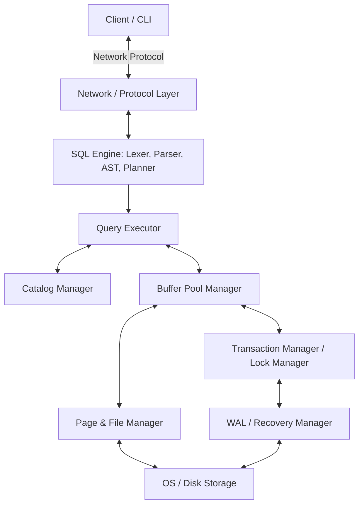

# System Architecture

RaptorDB is a relational SQL database engine written in Go from first principles. It follows a classic layered DBMS architecture.

## Component Interaction

The following diagram illustrates how the core packages interact to process client requests, parse SQL, optimize execution plans, manage memory buffers, and persist pages to disk:

## Architectural Layers

### 1. Transport & Protocol Layer (`network/`, `protocol/`)
Handles incoming client TCP connections, manages session states, and decodes/encodes the custom database wire protocol.

### 2. SQL Query Compiler (`sql/`)
- **Lexer & Parser**: Converts the raw SQL string into tokens and parses them into an Abstract Syntax Tree (AST).
- **Planner & Optimizer**: Generates logical query plans, estimates costs, and optimizes the plan into an executable physical plan.

### 3. Execution Engine (`executor/`, `catalog/`)
Executes the physical query plan using a Volcano-style (Iterator) model. It queries the system catalog for schema definitions and retrieves records.

### 4. Indexing & Storage Layer (`btree/`, `storage/`)
- **B+ Tree**: Provides fast index-based data retrieval and range scans.
- **Page & Record Manager**: Implements slotted-page storage and serialization formats for on-disk page frames.
- **File Manager**: Manages reading and writing pages from/to raw disk space.

### 5. Transaction & Recovery Layer (`transaction/`, `wal/`)
- **Transaction Manager**: Manages transaction lifecycles, ensuring ACID semantics.
- **Lock Manager**: Enforces strict two-phase locking (2PL) for concurrency control.
- **Write-Ahead Logging (WAL)**: Records transaction history to log files for recovery using the ARIES recovery protocol.
